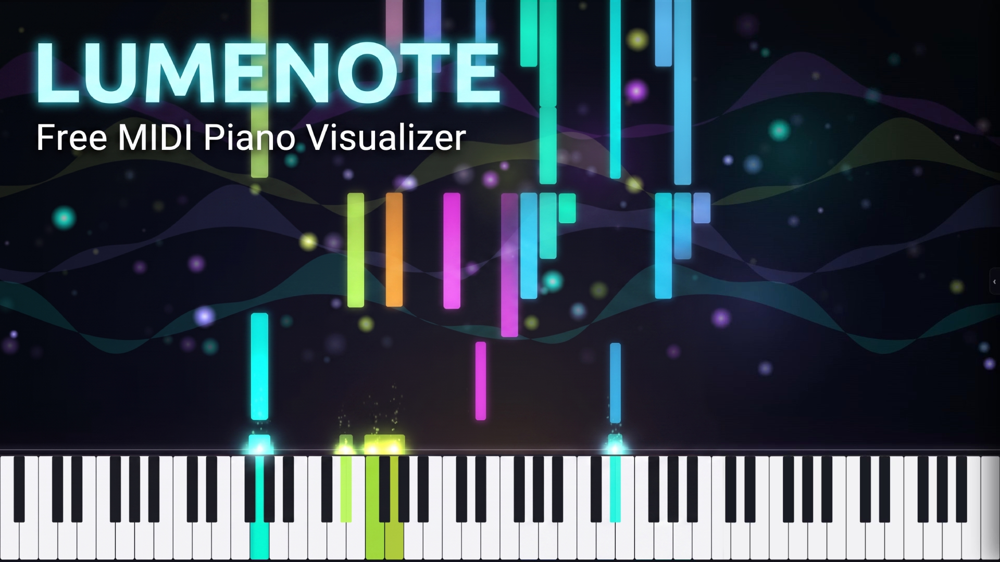

<p align="center">
  
</p>

<p align="center">
  
</p>

<h1 align="center">Lumenote</h1>

<p align="center">
  <a href="https://lumenote.nl"><strong>Try it live → lumenote.nl</strong></a>
  ·
  <a href="https://www.youtube.com/watch?v=BjfoS6BrbYg">Watch the demo on YouTube</a>
</p>

<p align="center">
  <strong>Multi-track MIDI piano visualizer in the browser.</strong><br />
  Falling notes · particles · live MIDI · SF2 · offline bake export up to 4K.<br />
  No watermark. No account. No install.
</p>

<p align="center">
  <a href="https://lumenote.nl"></a>
  <a href="#-quick-start"></a>
  <a href="#-features"></a>
  <a href="LICENSE"></a>
</p>

<p align="center">
  
  
  
  
  
</p>

---

## Why Lumenote?

Most piano MIDI visual tools are paid, watermarked, or locked to one OS.  
Lumenote is a **local-first web app** you own: load a multi-track MIDI, paint the look, and export a clean video.

| You get | Details |
|--------|---------|
| **Multi-track color** | Separate hands/tracks, recolor, mute, hide |
| **Cinema particles** | Presets + deep parameter control |
| **Music reactive** | Streams, shockwaves, bass pulse, ambient dust |
| **Atmosphere** | Nebula, aurora, starfield, pulse, grid… |
| **Party mode** | Parameters *dance* smoothly instead of jumping |
| **Scene presets** | Save full looks · built-in lookbooks |
| **Sound** | Piano, chiptune, pads, GM, **SF2/SF3** load |
| **Live MIDI** | Hardware keyboard in + optional MIDI out / thru |
| **Video export** | **Bake** smooth 720p–4K 30/60 MP4, or realtime capture |

---

## Features

### Visuals
- Falling notes over an adjustable 88-key keyboard  
- Impact rail, glow, scroll speed, note opacity, piano height  
- Color modes: **Palette** / palette wave, per-track, RGB cycle, pitch rainbow, spectrum, wave, chase  
- Track palettes (Neon, Cyber, Fire, Vapor…)  

### Motion and FX
- Particle engine (ember, neon, stardust, inferno…)  
- Music-reactive field driven by note density / pitch bands  
- Background orbs, stars, aurora bands, light beams  
- **Surprise me** + category toggles · **Party mode** dance  

### Audio
- Soft piano, **chiptune**, chip lead, e-piano, organ, pad, pluck, bass, strings  
- GM Chip / GM FM (TinySynth)  
- Load local **`.sf2` / `.sf3`** (SpessaSynth worklet)  

### Live MIDI
- Enable Web MIDI, pick input/output devices  
- Play a keyboard with visuals + synth sound (no file required)  
- Optional: send song playback to MIDI out, or **Thru** (in → out)  

### Video export
- **Bake (default):** offline stepped frames at exact fps - no dropped frames  
- **Realtime:** MediaRecorder capture while the song plays  
- 720p / 1080p / 1440p / 4K · 30 or 60 fps · optional audio · MP4 (bake) or WebM/MP4 (realtime)  
- Chrome / Edge recommended for bake and SF2  

### Workflow
- Landing page + studio sidebar (Scene / Audio / Look / Export)  
- Scene presets (built-in + saves in `localStorage`)  
- Fullscreen player (`F`); studio overlay in fullscreen (`B` or edge tab)  
- Shortcuts: `Space` play · `R` stop · `←` `→` seek · `Ctrl+P` party  
- **1s lead-in** on load so notes scroll in before the first hit (export included)  
- **BPM** readout from the MIDI tempo map (updates if tempo changes)  

---

## Quick start

```bash
git clone https://github.com/LumenoteApp/lumenote.git
cd lumenote
npm install
npm run dev
```

Open the URL Vite prints (usually **http://localhost:5173**).

### Production build

```bash
npm run build
npm run preview
```

---

## How to make a video

### Built-in export (recommended)
1. **Open** a multi-track MIDI (separate tracks/hands = separate colors).  
2. **Tune** scene, colors, particles, and sound.  
3. Open **Export** in the sidebar.  
4. Choose **Bake** (smooth) or **Realtime**, 30 or 60 fps.  
5. **Bake video** / **Start capture** and download the file.  

### Classic screen record
1. Press **`F`** for player fullscreen.  
2. Record with **OBS**, Windows Game Bar, or browser capture.  

> Tip: export hands as **two tracks** from your DAW / MuseScore for clean left/right colors.

---

## Docs

| Doc | Purpose |
|-----|---------|
| [docs/ARCHITECTURE.md](docs/ARCHITECTURE.md) | System design |
| [docs/DEVELOPMENT.md](docs/DEVELOPMENT.md) | Setup and conventions |
| [AGENTS.md](AGENTS.md) | Short rules for coding agents |

## Project layout

```text
src/
  engine/          # Playback, audio (Tone / TinySynth / SF2), Web MIDI
  midi/            # MIDI parse + types
  render/          # Canvas, VisualizerEngine, particles, bg, reactive field
  theme/           # Presets (particles, scenes, colors, party)
  ui/              # Landing, panels, transport, export
  export/          # Offline bake + realtime capture
docs/              # Architecture + development notes
public/
  spessasynth_processor.min.js   # SF2 AudioWorklet
```

---

## Stack

| Layer | Tech |
|-------|------|
| App | Vite · React · TypeScript |
| MIDI | `@tonejs/midi` · Web MIDI API |
| Audio | Tone.js · webaudio-tinysynth · [spessasynth_lib](https://github.com/spessasus/spessasynth_lib) |
| Graphics | Canvas 2D |
| Export | WebCodecs · [Mediabunny](https://mediabunny.dev/) · MediaRecorder |

---

## Roadmap ideas

- [x] Offline bake export (smooth 720p–4K 30/60 MP4)  
- [x] Realtime HD video capture (MediaRecorder)  
- [x] Live Web MIDI keyboard input + MIDI out  
- [x] Palette scatter color modes  
- [ ] Offline bake audio for GM/SF2 (currently Soft Piano fallback)  
- [ ] On-screen / QWERTY piano  
- [ ] GitHub Pages / hosted demo URL  
- [ ] More stock scene lookbooks  
- [ ] Optional background image / video layers  

PRs and issues welcome.

---

## License

[MIT](LICENSE) © LumenoteApp

---

<p align="center">
  <sub>Made for people who want piano videos that actually move - without a watermark.</sub>
</p>
