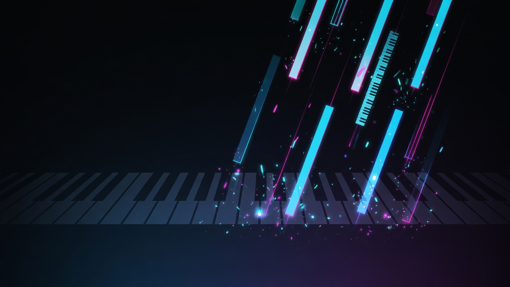
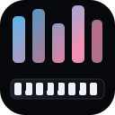

<p align="center">
  
</p>

<p align="center">
  
</p>

<h1 align="center">Lumenote</h1>

<p align="center">
  <strong>Multi-track MIDI piano visualizer in the browser.</strong><br />
  Falling notes · particles · music-reactive atmosphere · scene presets · SF2 soundfonts.<br />
  No watermark. No account. No install.
</p>

<p align="center">
  <a href="#-quick-start"></a>
  <a href="#-features"></a>
  <a href="LICENSE"></a>
</p>

<p align="center">
  
  
  
  
  
</p>

---

## Why Lumenote?

Most “pretty piano video” tools are paid, watermarked, or locked to one OS.  
Lumenote is a **local-first web app** you own: load a multi-track MIDI, paint the look, fullscreen, and capture with OBS.

| You get | Details |
|--------|---------|
| **Multi-track color** | Separate hands/tracks, recolor, mute, hide |
| **Cinema particles** | Presets + deep parameter control |
| **Music reactive** | Streams, shockwaves, bass pulse, ambient dust |
| **Atmosphere** | Nebula, aurora, starfield, pulse, grid… |
| **Party mode** | Parameters *dance* smoothly instead of jumping |
| **Scene presets** | Save full looks · 8 built-in lookbooks |
| **Sound** | Piano, chiptune, pads, GM, **SF2/SF3** load |
| **Clean export** | Fullscreen player · no watermark |

---

## ✨ Features

### Visuals
- Falling notes over an 88-key keyboard  
- Impact rail, glow, scroll speed, note opacity  
- RGB cycle, pitch rainbow, spectrum, wave & chase modes  
- Track palettes (Neon, Cyber, Fire, Vapor…)  

### Motion & FX
- Particle engine (ember, neon, stardust, inferno…)  
- Music-reactive field driven by note density / pitch bands  
- Background orbs, stars, aurora bands, light beams  
- **Surprise me** + category toggles · **Party mode** dance  

### Audio
- Soft piano, **chiptune**, chip lead, e-piano, organ, pad, pluck, bass, strings  
- GM Chip / GM FM (TinySynth)  
- Load local **`.sf2` / `.sf3`** (SpessaSynth worklet)  

### Workflow
- Landing page + studio  
- Scene presets (built-in + your saves in `localStorage`)  
- Fullscreen player (`F`) for recording  
- Keyboard: `Space` play · `R` stop · `←` `→` seek  

---

## 🚀 Quick start

```bash
git clone https://github.com/UnSlopd/lumenote.git
cd lumenote
npm install
npm run dev
```

Open the URL Vite prints (usually **http://localhost:5173**).

### Production build

```bash
npm run build
npm run preview
```

---

## 🎹 How to make a video

1. **Open** a multi-track MIDI (separate tracks/hands = separate colors).  
2. **Tune** scene presets, particles, or Party mode.  
3. Press **`F`** for player fullscreen.  
4. Record with **OBS**, Windows Game Bar, or browser capture.  

> Tip: export hands as **two tracks** from your DAW / MuseScore for clean left/right colors.

---

## 📚 Docs (for humans & AI sessions)

| Doc | Purpose |
|-----|---------|
| [docs/SESSION_NOTES.md](docs/SESSION_NOTES.md) | **Handoff** - start a new session here |
| [docs/ARCHITECTURE.md](docs/ARCHITECTURE.md) | System design |
| [docs/DEVELOPMENT.md](docs/DEVELOPMENT.md) | Setup & conventions |
| [AGENTS.md](AGENTS.md) | Short rules for coding agents |

## 🗂️ Project layout

```text
src/
  engine/          # Playback, audio (Tone / TinySynth / SF2)
  midi/            # MIDI parse + types
  render/          # Canvas: notes, particles, bg, reactive field
  theme/           # Presets (particles, scenes, colors, party)
  ui/              # Landing, panels, transport
docs/              # Architecture + session handoff notes
public/
  spessasynth_processor.min.js   # SF2 AudioWorklet
```

---

## 🛠️ Stack

| Layer | Tech |
|-------|------|
| App | Vite · React · TypeScript |
| MIDI | `@tonejs/midi` |
| Audio | Tone.js · webaudio-tinysynth · [spessasynth_lib](https://github.com/spessasus/spessasynth_lib) |
| Graphics | Canvas 2D |

---

## 🗺️ Roadmap ideas

- [x] Offline bake export (smooth 1080p 30/60 MP4, WebCodecs)  
- [x] Realtime HD video capture (MediaRecorder fallback)  
- [x] Live Web MIDI keyboard input + MIDI out  
- [ ] More stock scene lookbooks  
- [ ] Optional background image / video layers  

PRs and issues welcome.

---

## 📄 License

[MIT](LICENSE) © UnSlopd

---

<p align="center">
  <sub>Made for people who want piano videos that actually move - without a watermark.</sub>
</p>
